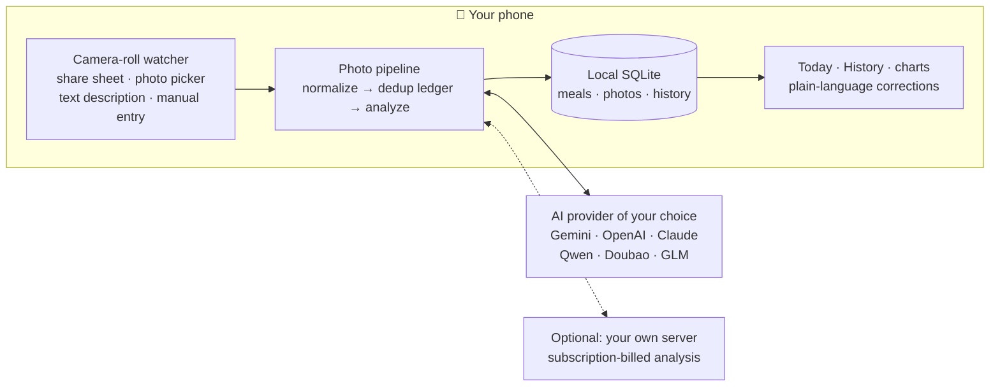
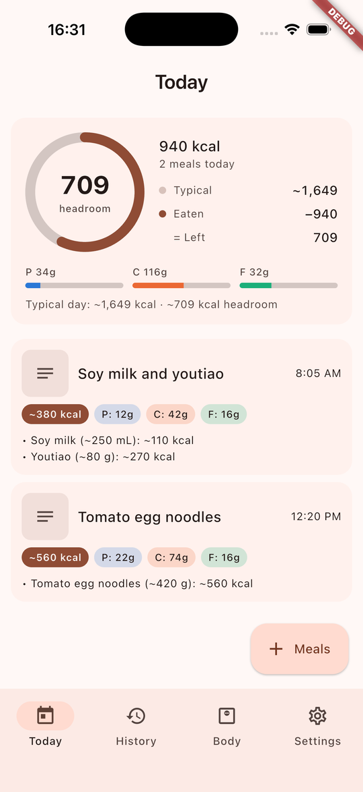
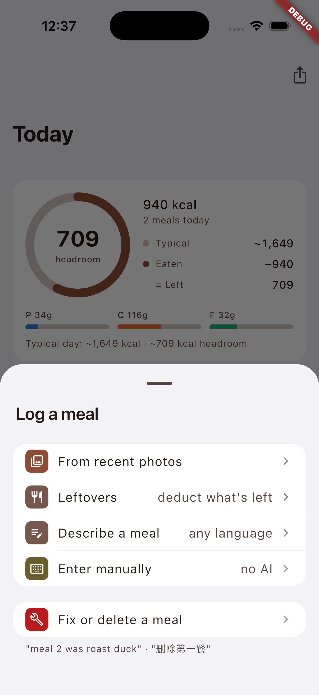
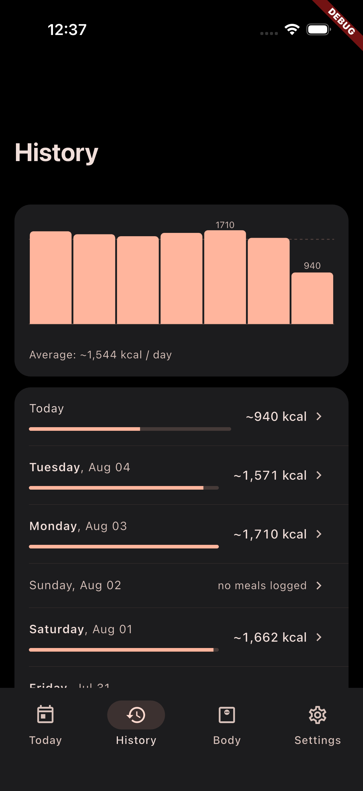
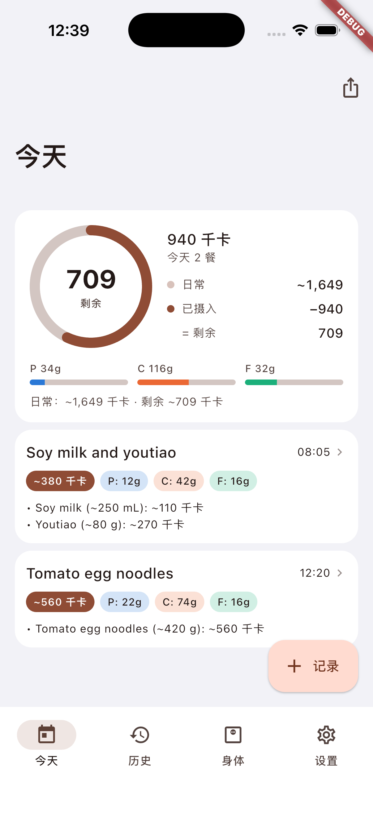
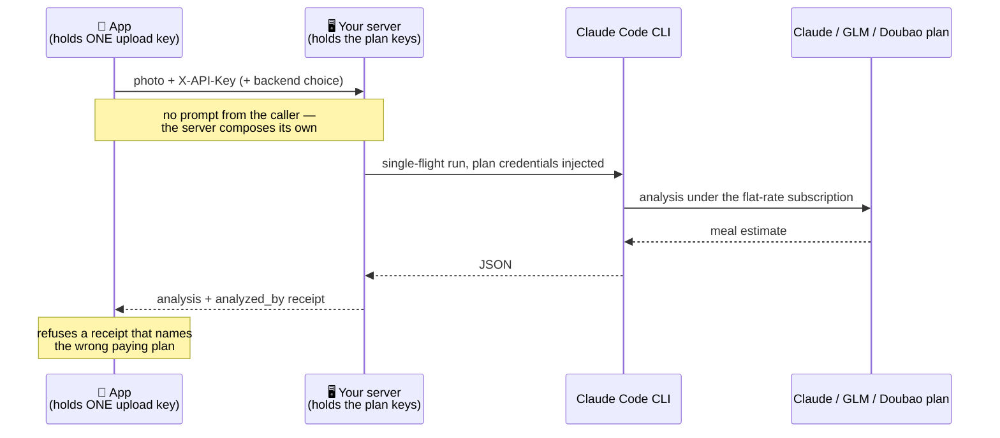
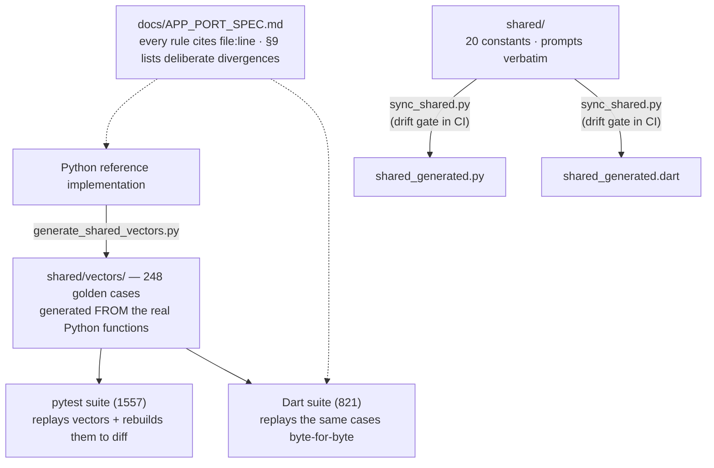

<div align="center">

# 🥢 Bitewise · 筷拍

**You eat. It notices.** Take photos the way you already do — the app finds the food ones, an AI model reads them like a nutritionist (labels first, estimates last), and your calorie log writes itself. Even leftovers deduct themselves. **Your data stays on your phone; only the photo being analyzed ever leaves it.**

<p>
  <a href="https://github.com/AkiyamaKunka/CalorieTracker/actions/workflows/python-tests.yml"></a>
  
  
</p>

*Formerly CalorieTracker. A Flutter app for iOS and Android — plus an optional self-hosted server that lets an existing AI subscription pay for analysis instead of metered API keys.*

</div>

---

The core loop is **automatic**: turn on *Watch camera roll* and every food photo you take — meals, takeout order screenshots, nutrition labels — becomes a logged meal with calories, protein, carbs, and fat, without opening the app. Photograph what's LEFT on the plate afterwards and the app recognizes it as the same meal and **deducts the uneaten part** instead of double-counting. Everything lands in a local log you can browse, chart, edit, and correct in plain language (*"the noodles were actually roast duck rice"*, *"删除第一餐"*). No account, no analytics, no cloud database. Full Chinese UI. Works in mainland China without a VPN, and there is a completely free way to run it (Zhipu GLM's default vision model costs nothing).

## How it works

**1 · Eat as usual.** Take photos the way you already do — of the meal, the takeout order screen, or the nutrition label. There is no app to open: with *Watch camera roll* on, new food photos are noticed and picked up automatically (share-sheet, photo picker, plain-text description, and manual entry all feed the same pipeline).

**2 · The AI reads evidence before it estimates.** Each photo is analyzed against a strict evidence ladder — a nutrition label beats a printed weight, a printed weight beats brand data, and only when no printed truth exists does it fall back to visual estimation calibrated against real-size references. Every meal states which evidence it used and the portion assumptions it made, so a wrong guess is visible and fixable.

**3 · Your log corrects itself — and listens.** Photograph what's left on the plate and the meal shrinks to what you actually ate, automatically. Anything else you'd change, just say: *"lunch was about 650 kcal"*, *"the second meal had no rice"*, *"删掉昨天的宵夜"* — any language your model reads.



*Everything stays on your phone except the single photo being analyzed.*

<p align="center">
  
  
  
  
</p>
<p align="center"><sub><i>Demo data. The design pass is research-driven — ten leading health apps studied, lessons applied, backlashes avoided.</i></sub></p>

## Features

**Photo → meal log, automatically.** Turn on *Watch camera roll* and every food photo you take logs itself — no need to open the app after each meal. Dedup is guaranteed: a photo is never analyzed (or billed) twice, even across restarts, double-taps on share, or a 200-photo backlog. Share-sheet photos are dated by the JPEG's own EXIF shutter time, so a 23:50 dinner shared after midnight lands on *yesterday's* total.

**AI conclusions from evidence, not guesses.** The analysis follows a strict, user-editable evidence ladder (`shared/prompts/estimation_priority.txt`): a **nutrition label** in the photo beats everything (including the Chinese kJ-per-100g conversion), then a **printed weight** (scale sticker, package, receipt), then **brand-published data** for recognized chains and packaged goods — and only then visual estimation, calibrated against real-size references (chopsticks, bowls, hands) with the assumed grams stated in every item name so you can spot and fix a wrong assumption. Every meal says which evidence it used.

**Leftovers deduct themselves.** Photograph what's left on the plate and the analysis recognizes it as the remains of a meal you already logged — same tray, food visibly reduced — and shrinks that meal to what you actually ate instead of logging a phantom second meal. All arithmetic runs in deterministic, clamped code against the local database; the model only ever supplies fractions. Confidence-gated with a manual *Leftovers* flow as the fallback and repair path.

**Corrections in your own words.** *"Lunch was about 650 kcal"*, *"the second meal had no rice"*, *"删掉昨天的宵夜"* — the app updates or deletes meals from plain language, in any language your model reads, and always confirms before deleting. Describing a brand-new meal in text works the same way.

**Today, History, and honest charts.** Today shows running totals and a comparison against your *typical day* (a median, so under-logged days don't drag it down). History covers 30 days — and days where nothing was logged appear dimmed as *"no meals logged"* instead of silently vanishing, so a broken watcher looks broken. Meal detail draws a per-macro energy split (4/4/9 kcal per gram), live-updating as you edit.

**Seven AI providers — three reachable from mainland China without a VPN.** Keys are yours, entered once, stored in the platform secure keystore; switching providers takes effect on the next photo. For scale: a month of meal photos on a pay-per-call provider typically costs well under a dollar, and the GLM route is free.

| Provider | Vision | From mainland China | Cost model |
|---|:---:|:---:|---|
| Google Gemini | ✅ | VPN needed | free tier (daily cap handled gracefully) |
| OpenAI | ✅ | VPN needed | pay per call |
| Anthropic Claude | ✅ | VPN needed | pay per call |
| Alibaba Qwen 通义千问 | ✅ | ✅ direct | pay per call, inexpensive |
| ByteDance Doubao 豆包 | ✅ | ✅ direct | pay per call |
| Zhipu GLM 智谱 | ✅ | ✅ direct | **default vision model is free** |
| Your own server (self-hosted) | ✅ | ✅ | your Claude / GLM / Doubao subscription — [see below](#subscription-powered-analysis-optional-self-hosted) |

**A diagnostics page that names the actual problem.** *Test AI provider* runs six staged checks — configuration, endpoint reachability, authentication & account credit, text round-trip, photo round-trip, quota state — and each failure states what is wrong and what to do about it: an out-of-credit account is not a "wrong key", an unreachable Gemini suggests a domestic provider, a rate limit says *wait* while a dead balance says *recharge*.

**Body tracking.** Weight history with an honest trend chart (logged by hand or just by telling the chat "I weigh 81.6 kg"), plus waist, chest and hip measurements — one tap to log, editable, exported with everything else.

**Privacy.** Meals, photos, and thumbnails live in SQLite on the device. The only network traffic is the photo you chose to analyze, going to the provider you chose. Export writes a JSON file you own; import merges it back (device moves are two taps), never destructively.

**Small details.** Full Chinese UI with a live in-app language switcher; imperial units (lb/in) for body data in the English UI. On the self-hosted subscription path you can pick the analysis model (Fable / Opus / Sonnet / Haiku) and thinking effort per request, from the phone. Every meal keeps a thumbnail even after you clean your gallery. Manual entry works offline with no key at all. Light and dark, Apple-style design.

## Getting started

**Android — just install it:** grab the APK from the [latest release](https://github.com/AkiyamaKunka/CalorieTracker/releases/latest), open it on your phone (allow "install unknown apps" if asked), then pick a provider and paste a key in Settings. **iPhone:** no prebuilt binary — sideloading requires a signature, so installing currently means building from source on a Mac with Xcode.

**Developers** need Flutter (Dart SDK ≥ 3.12.2):

```bash
git clone https://github.com/AkiyamaKunka/CalorieTracker.git
cd CalorieTracker/app
flutter pub get
flutter run
```

Then in **Settings**: pick a provider, paste your API key, and optionally enable *Watch camera roll*. Zero-cost start: create a GLM key at open.bigmodel.cn — its default vision model is free — and you're logging meals in two minutes. On iOS, open `ios/Runner.xcworkspace` once in Xcode to set your signing team.

Building the shareable APK (from the repo root):

```bash
bash scripts/build_share_apk.sh   # → ~21 MB arm64 APK in ~/Desktop/CalorieTracker-share/
```

## Subscription-powered analysis (optional, self-hosted)

*Skip this unless you already pay for a Claude, GLM Coding Plan, or Doubao Agent Plan subscription and are comfortable running a small server.*

The companion server turns a flat-rate subscription into the app's analysis backend: the phone posts the photo to your machine, which runs the analysis through the Claude Code CLI under your plan — no per-call API spend. Check your plan's acceptable-use terms before routing app traffic through it.



The security shape is deliberate:

- Plan credentials live only in the server's `.env` — the phone holds one upload key and nothing else. An APK is a shipping container; nothing subscription-shaped is ever baked into it.
- The phone cannot supply the analysis prompt — the server composes its own (the phone may add only a bounded dietary-profile appendix). A caller-authored prompt would be an instruction channel into a CLI.
- Replies carry an `analyzed_by` receipt and the app refuses a mismatch, so the wrong plan can never silently pay.
- When the subscription token expires, the app drives the server's official OAuth re-connect from the phone — the secret never travels.

Setup, operations, and the app-facing API are documented in **[docs/SERVER.md](docs/SERVER.md)**.

## For engineers

The part of this codebase most worth reviewing is how **two full implementations of the same product are kept behaviorally identical** — a Python server and a Dart app, no shared runtime code:

1. **A spec with line-number citations.** [docs/APP_PORT_SPEC.md](docs/APP_PORT_SPEC.md) extracts every behavioral rule from the production Python with `file:line` evidence, and §9 is a table of *deliberate* divergences — each row says what differs, why, and which test pins it.
2. **Shared constants and prompts, generated for both runtimes.** [shared/](shared/) holds 20 behavior constants (normalization size, dedup windows, validation bounds…) and the prompts verbatim; `scripts/sync_shared.py --check` is a drift gate run in CI.
3. **248 golden vectors, replayed by both suites.** Python is the oracle: its real functions generate [shared/vectors/](shared/vectors/) (coercion of hostile model output, capture-time dating, NL normalization, report formulas…), and the Dart suite must match byte-for-byte — including NaN/Infinity and expected-throw cases. Cross-language drift is a failing test, not a field bug.



Other things a reviewer will find:

- **A provider conformance matrix** ([provider_feedback_matrix_test.dart](app/test/analyzer/provider_feedback_matrix_test.dart)): seven providers tested against a shared vocabulary of eight failure classes (auth, rate limit, billing, model-not-found, overloaded, content filter, junk reply, daily quota), with 39 fixtures that are *verbatim wire bodies* from the real endpoints. "Out of money" alone arrives as five different shapes — OpenAI `429 insufficient_quota`, GLM `429` code 1113, Doubao `403 AccountOverdueError`, Qwen `400 Arrearage`, Anthropic `400` credit-balance — all mapped to one user-facing verdict: *recharge, don't regenerate the key*.
- **A photo pipeline built around one identity.** md5 of the original bytes drives a five-state reservation ledger (`processing / saved / skipped / failed / deleted`): reserve-before-analyze, meal-insert + `saved` in one transaction, tombstones so deleted meals never resurrect, and a strict/deliberate split — the automated watcher never reclaims a failed row, a human re-add may. All intake is serialized through one FIFO tail: one photo's bytes resident at a time, no self-inflicted rate limits.
- **A capture-dating chain with a trust boundary.** Filename timestamp → library asset date → EXIF `DateTimeOriginal` → intake time; every candidate passes the same validation window (reject > 1 h future, > 45 days old) because EXIF is attacker-controlled junk until proven otherwise.
- **Test discipline.** Both full suites (currently 821 Dart + 1557 Python tests) run in CI on every push — and the suites are reviewed for their *capacity to fail*: several were rewritten after being caught passing while broken.

## The Telegram bot (the original interface, kept as a backup)

CalorieTracker began as a Telegram bot, and that whole path still works if chat is your preferred interface — or your fallback when the phone is out of reach:

- Send a food photo to the bot in chat — same analysis pipeline, same dedup ledger, same database.
- Correct or delete meals conversationally, with confirmation before any delete.
- Daily calorie/macro reports pushed to Telegram, plus ops commands (`/status`, `/doctor`, `/retry_failed`).

One process serves both the bot and the app's API; `TELEGRAM_POLLING=0` retires the chat half while the phone keeps working. See **[docs/SERVER.md](docs/SERVER.md)**.

## Testing

```bash
python3 -m pytest -q                         # server suite
(cd app && flutter analyze && flutter test)  # app suite
python3 scripts/sync_shared.py --check       # server↔app parity bindings
bash scripts/check_public_safety.sh          # secrets/PII gate (PUBLIC_SAFETY_SCAN_HISTORY=1 scans full git history)
```

CI runs all of the above on every push: the Python suite on 3.9 and 3.10 with `ruff` and a coverage floor, the Flutter suite, the parity drift gate, and the safety gate.

## Project layout

```
app/                    Flutter app (iOS + Android) — start here
shared/                 constants, prompts, and golden vectors both sides compile from
docs/APP_PORT_SPEC.md   the behavioral spec that keeps server and app identical
docs/SERVER.md          running the server: subscription analysis, Telegram bot, app API
telegram_bot.py         the server: Flask API for the app + Telegram interface
scripts/                parity sync, vector generation, APK build, safety gate
tests/                  Python suite   ·   app/test/   Dart suite
```

## Contributing

Issues and PRs welcome — see [CONTRIBUTING.md](CONTRIBUTING.md) for setup and expectations. Two rules matter more than style:

1. **Never commit a credential.** Run `bash scripts/check_public_safety.sh` before pushing — with `PUBLIC_SAFETY_SCAN_HISTORY=1` it scans full git history, including binary blobs. The published history was deliberately rewritten so that no credential exists anywhere in it; keep it that way.
2. **Server and app must stay in parity.** Change behavior in `shared/`, regenerate with `python3 scripts/sync_shared.py`, and run both suites.

## License

[MIT](LICENSE) © 2026 AkiyamaKunka
