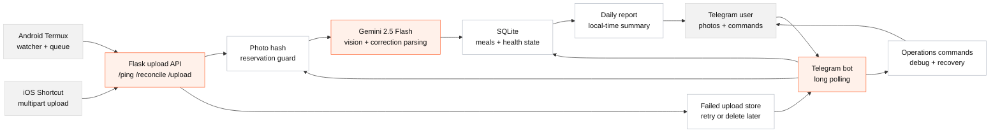

# CalorieTracker

<p align="center">
  <strong>Private-first calorie tracking from food photos.</strong><br>
  Android, iPhone, and Telegram send photos. Gemini estimates the meal. SQLite keeps the record. Telegram stays the control room.
</p>

<p align="center">
  
  
  
  
  
</p>

---

## Overview

CalorieTracker is a small automation system for personal food logging. It accepts food photos from mobile devices and Telegram, analyzes them with Google Gemini, saves the structured meal data in SQLite, and sends results plus daily reports back to Telegram.

| Signal | What it means |
| --- | --- |
| Private by default | One allowed Telegram chat, local `.env`, local SQLite, ignored runtime data |
| Mobile-first | Android Termux watcher, iOS Shortcut upload, direct Telegram photos |
| Recoverable | Failed uploads are saved for retry instead of silently dropped |
| Observable | `/status`, `/doctor`, `/gemini`, `/queue`, `/vpn`, `/report_status`, `/logs` |
| Quota-aware | Gemini daily quota exhaustion pauses retries and asks the user what to do |

## Architecture



## Technical Framework

| Layer | Technology | Responsibility |
| --- | --- | --- |
| Bot interface | Telegram Bot API, long polling | User commands, corrections, photo feedback, operational alerts |
| Upload API | Flask | Authenticated phone uploads, heartbeat pings, Android reconciliation |
| AI analysis | Google Gemini 2.5 Flash (default) + optional Claude-first analyzer | Food detection, calorie and macro estimation, correction parsing; photo analysis can run Claude-first via the Claude Code CLI on a Claude subscription, with Gemini as automatic fallback |
| Persistence | SQLite | Meals, hashes, correction state, Android heartbeat, photo ingestion guard, fitness data (weight, workouts, activities, profile) |
| Mobile clients | Android Termux, iOS Shortcuts | Camera automation, VPN evidence headers, offline queueing |
| Scheduling | systemd or launchd | Always-on bot service and local-time daily reports |
| Reliability | Failed-upload store, quota circuit breaker, `/doctor` checks | Recovery from quota, network, duplicate, and report failures |
| Security | `.env`, `ANDROID_API_KEY`, private chat allowlist | Keep secrets local and restrict uploads/commands to the owner |

## Core Features

- Food photo analysis with Google Gemini (native JSON output; photos are downscaled on the phone and again server-side before each call, so quota and bandwidth aren't spent on 25MB camera files). Beverages count as loggable food — a latte gets calories, plain water doesn't.
- Optional Claude-first analysis: with `CLAUDE_ANALYZER_ENABLED=1` and a `claude setup-token` credential, photos are analyzed through the Claude Code CLI on a Claude subscription (no per-token API cost); any failure — usage window, timeout, bad output — falls back to Gemini automatically, so the default path never degrades.
- Backfilled photos land on the day they were **taken**, not uploaded: clients declare `captured_at` (Android derives it from the camera filename; iOS sends the photo's Creation Date header) and the server validates it before dating the meal.
- iOS uploads may send the image as a raw request body (`Request Body: File` in Shortcuts) — the server accepts both multipart and raw-image POSTs, working around an iOS bug where Form file fields silently coerce to text.
- Calories, protein, carbs, fat, meal source, photo hash, and correction state in SQLite.
- Reports flag meals whose item calories contradict their total and likely duplicates; the daily report includes a 7-day average and `/today` shows your typical-day intake.
- Uploads from Telegram photos, Android Termux, and iOS Shortcuts.
- Natural-language meal corrections and deletions in Telegram (deletions ask for inline confirmation before touching data).
- Meals are dated in the phone's reported timezone, so a midnight snack lands on the right day even when the server runs in UTC.
- Daily Telegram reports with missed-day catch-up, plus optional PushPlus/WeChat forwarding.
- Saved failed uploads with user-controlled retry or delete.
- Graceful shutdown, plus a startup sweep that recovers uploads stranded mid-analysis by a crash.
- Runtime health written to `logs/service_health.json`.
- Duplicate protection through a photo-hash reservation guard.
- Fitness tracking: daily weigh-ins, diet modes with macro targets (keto / high-protein / balanced), Daniels-VDOT run planning, and manual or Garmin activity logging with a net-calorie line in daily reports.

## Repository Safety

This app is meant for a private deployment. Never commit `.env`, phone config, exported Shortcuts, logs, reports, DB files, or personal dietary profiles.

Before publishing publicly, read [SECURITY.md](SECURITY.md). If this repo ever had secrets in git history, publish from a fresh clean export or rewrite history and rotate the exposed credentials.

```bash
bash scripts/check_public_safety.sh
```

## Requirements

| Required | Optional |
| --- | --- |
| Python 3.10+ | GCP/Linux VM with `systemd` |
| Google Gemini API key | PushPlus token/topic for WeChat forwarding |
| Telegram bot token | Reverse proxy, HTTPS, or VPN for phone uploads |
| | Claude Code CLI + `claude setup-token` credential for Claude-first photo analysis (`CLAUDE_ANALYZER_ENABLED=1`) |
| Numeric Telegram chat ID | Android Termux and iOS Shortcuts clients |
| Long random `ANDROID_API_KEY` | Personal `dietary_profile.txt` |

## Setup

```bash
git clone <your-repo-url> ~/CalorieTracker
cd ~/CalorieTracker
python3 -m venv venv
source venv/bin/activate
pip install -r requirements.txt
cp .env.example .env
```

Install at `~/CalorieTracker`: runtime data (`meals.db`, `logs/`, `reports/`, `dietary_profile.txt`) is always read from and written under `~/CalorieTracker`, regardless of where the scripts are launched from.

Edit `.env`:

```env
GEMINI_API_KEY=replace-with-google-ai-studio-key
GEMINI_MODEL=gemini-2.5-flash
TELEGRAM_BOT_TOKEN=replace-with-botfather-token
TELEGRAM_CHAT_ID=replace-with-your-numeric-chat-id
ANDROID_API_KEY=replace-with-random-upload-api-key
PUSHPLUS_TOKEN=
PUSHPLUS_TOPIC=
VPN_OFF_COUNTRY_CODES=CN
VPN_REMOTE_CIDRS=
VPN_OFF_REMOTE_CIDRS=
```

Generate the upload key:

```bash
python3 -c "import secrets; print(secrets.token_urlsafe(32))"
```

Optional dietary context:

```bash
cp dietary_profile.example.txt dietary_profile.txt
```

`dietary_profile.txt` is ignored by git.

## Run Locally

```bash
source venv/bin/activate
python3 telegram_bot.py
```

The bot starts Telegram long polling and a Flask upload API on `0.0.0.0:5000`.

| Endpoint | Purpose |
| --- | --- |
| `POST /ping` | Phone heartbeat and VPN evidence |
| `POST /reconcile` | Android asks which local photo hashes are missing |
| `POST /upload` | Android/iOS multipart photo upload |

All phone API requests must include:

```http
X-API-Key: <ANDROID_API_KEY>
```

<details>
<summary><strong>Production with systemd</strong></summary>

Example service:

```ini
[Unit]
Description=CalorieTracker Telegram Bot and Upload API
After=network.target

[Service]
User=ubuntu
WorkingDirectory=/home/ubuntu/CalorieTracker
EnvironmentFile=/home/ubuntu/CalorieTracker/.env
Environment="PATH=/home/ubuntu/CalorieTracker/venv/bin"
ExecStart=/home/ubuntu/CalorieTracker/venv/bin/python3 telegram_bot.py
Restart=always
RestartSec=5

[Install]
WantedBy=multi-user.target
```

Enable it:

```bash
sudo systemctl daemon-reload
sudo systemctl enable caloriebot.service
sudo systemctl start caloriebot.service
sudo systemctl status caloriebot.service
```

If phones cannot reach port `5000`, put the service behind a reverse proxy, VPN, firewall rule, or port-forward. Prefer HTTPS or VPN for real deployments because plain HTTP exposes upload metadata and the upload key to the network path.

</details>

## Mobile Uploads

### Android

Android uses Termux.

1. Install Termux and Termux:API.
2. Copy `android/upload_photo.py` and `android/android_watcher.sh` to the phone.
3. Copy `android/calorie_tracker_upload.example.json` to `~/.calorie_tracker_upload.json`.
4. Edit the JSON with your server URL and `ANDROID_API_KEY`.
5. Set permissions:

```bash
chmod 600 ~/.calorie_tracker_upload.json
```

Example config:

```json
{
  "ANDROID_API_KEY": "same-random-value-as-server",
  "SERVER_URLS": [
    "https://your-domain.example",
    "http://YOUR_SERVER_IP:5000"
  ]
}
```

Run:

```bash
termux-wake-lock
python3 ~/upload_photo.py --ping
nohup bash ~/android_watcher.sh >> ~/watcher.log 2>&1 &
```

Useful manual commands:

```bash
python3 ~/upload_photo.py --ping
python3 ~/upload_photo.py --sync
python3 ~/upload_photo.py /storage/emulated/0/DCIM/Camera/example.jpg
```

Or automate install and restarts with the bundled installer: put `upload_photo.py` and `android_watcher.sh` in `/sdcard/Download`, copy `android/install_and_start.sh` to the phone, and run:

```bash
bash install_and_start.sh
```

It verifies the source files before stopping the running watcher, preserves the offline upload queue across reinstalls, and restarts everything under a wake lock.

One-tap control (optional, no typing in Termux): install the free [Termux:Widget](https://f-droid.org/packages/com.termux.widget/) add-on, copy the repo's `android/shortcuts/` folder to `/sdcard/Download/shortcuts` before running the installer (it places them in `~/.shortcuts`), then add the Termux widget to your home screen. You get ▶️ start, 🔴 stop, 📊 status (including offline-queue depth), 🔄 sync-now, and 🔁 update buttons. A double-tap on start is harmless — the watcher's lock makes it a no-op.

With USB debugging enabled, updating the phone is two steps: `adb push android/upload_photo.py android/android_watcher.sh android/install_and_start.sh /sdcard/Download/ && adb push android/shortcuts /sdcard/Download/shortcuts` from the dev machine, then tap 🔁 update on the phone (it runs the installer, which pre-flights the payload before touching the running watcher).

Watcher behavior worth knowing: new photos are marked as handled after a successful upload or safe offline queueing; a photo that fails three consecutive attempts is recorded anyway (with a loud log line) so it cannot wedge the loop, and photos already on the phone at watcher startup are skipped rather than uploaded as a backlog — the nightly sync covers both cases (photos newer than `SEED_FRESH_MINUTES`, default 15, upload immediately instead). Partially-written camera files are skipped until their size stabilizes (a file that never stabilizes — e.g. a permanently unreadable or 0-byte file — is recorded after a few attempts so it can't wedge the loop, with the nightly sync still able to recover it if it later becomes readable), and photos the server permanently rejects are quarantined in `~/.offline_queue/rejected/`. The nightly `--sync` reconciles today's and yesterday's photos (including HEIC) against the server. Idle polling is mtime-gated (one `stat` per 5s tick when nothing changed), `watcher.log` rotates at 1MB, and daily housekeeping prunes history entries for deleted photos.

If Pillow is installed in Termux (`pip install pillow`, optional), photos are recompressed to ≤1600px JPEG before upload — a 10–25MB camera shot becomes a few hundred KB on cellular — while dedup still keys on the original file's hash. Without Pillow (or for undecodable HEIC), originals upload unchanged.

If your camera saves somewhere other than `DCIM/Camera`, set `CAMERA_DIR` (or `CALORIE_CAMERA_DIR`) in the environment for both the watcher and manual runs. Advanced env-only knobs: `PING_INTERVAL_SECONDS` (heartbeat, default 900), `SEED_FRESH_MINUTES`, `CALORIE_HOUSEKEEP_POLLS`, `CALORIE_RECOMPRESS_MAX_EDGE` (0 disables recompression) / `CALORIE_RECOMPRESS_JPEG_QUALITY`, `CALORIE_TRACKER_SERVER_URLS`, `CALORIE_TRACKER_ANDROID_CONFIG`, `QUEUE_BATCH_LIMIT`, `QUEUE_LOCK_STALE_SECONDS`, `ANDROID_VPN_ACTIVE`.

### iPhone

Use the logic in [ios/shortcut_upload_to_gcp.md](ios/shortcut_upload_to_gcp.md).

Required request shape:

| Field | Value |
| --- | --- |
| URL | `https://your-domain.example/upload` or `http://YOUR_SERVER_IP/upload` |
| Method | `POST` |
| Body | `Request Body: File` with the (converted-to-JPEG) photo — recommended; iOS silently breaks Form file fields. Multipart form field `photo` also works. |
| `X-API-Key` | Same `ANDROID_API_KEY` |
| `X-Client-Platform` | `iOS` |
| `X-Device-Name` | `iPhone` |
| `X-VPN-Required` | `true` |
| `X-Captured-At` | Optional: photo Creation Date as `yyyy-MM-dd HH:mm:ss`, so delayed uploads date to the capture day |

Do not commit exported `.shortcut` or `.wflow` files.

## Failure Modes

What happens when parts of the pipeline are down:

| Scenario | Behavior |
| --- | --- |
| Photo taken while the server is unreachable (Android) | Queued in `~/.offline_queue`; drained automatically after the next successful heartbeat. Photos the server permanently rejects are quarantined in `~/.offline_queue/rejected/` instead of blocking the queue. |
| Uploader crashes on a photo | Retried on the next polls up to 3 attempts, then recorded with a loud log line; the nightly sync can still recover it. |
| Photo taken just before starting the watcher | Uploaded by the first polls — startup seeding skips photos newer than `SEED_FRESH_MINUTES` (default 15). Older backlog is not mass-uploaded. |
| Photo taken while the watcher was stopped | Recovered by the nightly `--sync` (covers today and yesterday) once the watcher is running again, or by a manual `--sync`. |
| Server crashes mid-analysis | On restart, staged uploads move to the failed store (recover with `/retry_failed`) and orphaned in-flight reservations are released so retries aren't misreported as duplicates. |
| Phone stops reaching the server | The bot warns you in Telegram once the heartbeat is older than `HEARTBEAT_STALE_WARNING_HOURS` (default 2h). |
| Gemini daily quota exhausted | 12h circuit breaker; failed uploads are kept with keep/discard buttons instead of being dropped. |
| Machine asleep at report time | The next `daily_report.py` run catches up on the missed day (deduped via the health ledger). |
| iOS upload fails | Not retried — the Shortcut is best-effort, one photo per camera close, with no queue or sync. Re-open the Camera or send the photo via Telegram. |

## VPN Detection

The server records VPN evidence from client headers and remote IP geolocation. By default, `VPN_OFF_COUNTRY_CODES=CN`, so non-China exit IPs are treated as VPN-looking traffic. This avoids warnings when a VPN switches between multiple exit countries.

Use these only when needed:

- `VPN_REMOTE_CIDRS` for known VPN provider ranges
- `VPN_OFF_REMOTE_CIDRS` for known direct/non-VPN ranges
- `/vpn` in Telegram to inspect the latest evidence

The upload API trusts the direct peer IP and ignores `X-Forwarded-For`. If you ever put a reverse proxy in front of it, set `TRUSTED_PROXY_ENABLED=1` so the forwarded address is honored.

## Telegram Commands

Run `/commands` for the full menu.

| Area | Commands |
| --- | --- |
| Tracking | `/today`, `/meals`, `/recent`, `/history` |
| Fitness | `/weight 72.5`, `/diet balanced`, `/macros today`, `/workout legs`, `/train`, `/activity 450 8000 5`, `/train_run 5k 19:57`, `/plan`, `/profile` |
| Health | `/status`, `/doctor`, `/gemini`, `/android`, `/vpn` |
| Uploads | `/queue`, `/failed`, `/retry_failed latest`, `/retry_all_failed 3`, `/clear_failed latest confirm` |
| Reports | `/report today`, `/report_status`, `/reports` |
| Debug | `/logs 30`, `/config`, `/stats` |

## Daily Reports

Manual:

```bash
python3 daily_report.py
python3 daily_report.py 2026-06-28
```

When run without a date, `daily_report.py` resolves the target date from the last phone-reported timezone: at 23:00 local or later it reports on the current day; earlier in the day it catches up on the previous day instead. A date the scheduler already sent successfully is skipped (tracked in `logs/service_health.json`), so a machine that was asleep at report time delivers the missed report on its next run rather than dropping it. Schedule it around 23:30 local time with cron/systemd timers/launchd. Failures are recorded in the health ledger and alerted to Telegram.

## Tests

```bash
bash scripts/check_public_safety.sh
python3 -m py_compile config.py telegram_bot.py daily_report.py android/upload_photo.py database.py meal_relay.py migrate_to_sqlite.py utils.py service_health.py
python3 -m pytest -q
```

## Runtime Data

Ignored local data:

- `.env`
- `logs/`
- `reports/`
- `outputs/`
- `*.db`
- `dietary_profile.txt`
- `*.shortcut`
- `*.wflow`
- `__pycache__/`

Keep backups of `meals.db`, `logs/failed_uploads/`, and reports separately if you care about the data.
